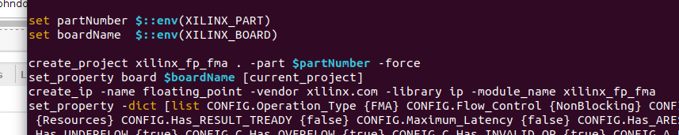
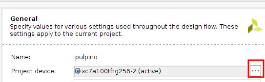
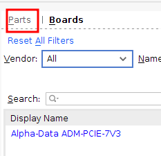
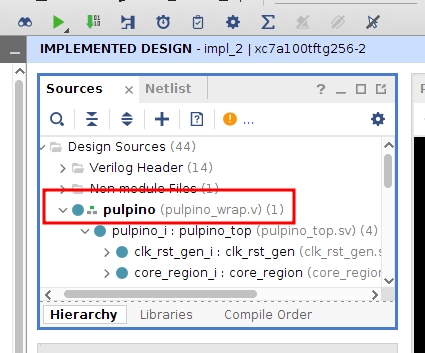

# PULPINO on ChipWhisperer 305

This repository contains the steps needed to generate the bitstream for a
ChipWhisperer 305 board with a Artix 7. Specifically, these instructions target
the Arty A7-100T board variant. Steps are outlined below.

## Steps

### Requirements

- A Linux PC
- [Xilinx Vivado 2019.1][vivado]. This specific version can be found in the
  `Vivado Archive`. This may work on other versions of Vivado, but it has not
  been tested.
- [Digilent Arty A7 Board Files][boardfiles]
- Python2
- Apt `build-essential`
- Any text editor

### Outside Vivado

1. Clone `https://github.com/pulp-platform/pulpino.git`
2. `cd pulpino`
3. `source environment.sh` from this repository
4. `./update-ips.py` with python2 installed as the default python toolchain
5. Replace `fpga/pulpino/constraints.xdc` with the `constraints.xdc` from this
   repository.
6. Open `fpga/ips/xilinx_fp_fma/tcl/run.tcl`.
   1. At line ~13, append ` -force` to the line.
   2. At line ~15, remove ` -version 7.0`
   
7. `cd fpga` and `make all`. This will fail but that is fine.

### Inside Vivado

1. Open `fpga/pulpino/pulpino.xpr` in Vivado 2019.1.
2. Go to `Tools -> Settings -> General -> Project Device`. Click the `...`. Go
   to the `Parts` tab.
  
  
  1. Select `xc7a100tftg256-2`. If it does not show up, verify you have
     installed the board files.
  2. Click `Apply` and exit menu
  3. This gives a warning. Click okay and accept `synth_2`.
3. Replace `fpga/rtl/pulpino_wrap.v` with the `pulpino_wrap.v` from this
   repository.
  
4. Run Synthesis.
5. Run Implementation.
6. Generate the Bitstream.

[vivado]: https://www.xilinx.com/support/download.html
[boardfiles]: https://digilent.com/reference/programmable-logic/guides/installing-vivado-and-sdk#installing_digilent_board_files